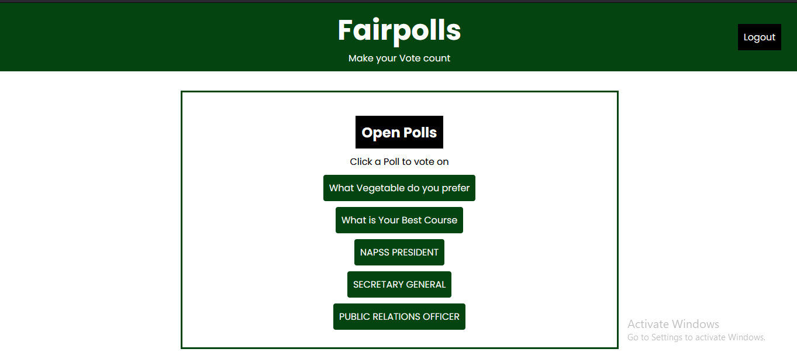
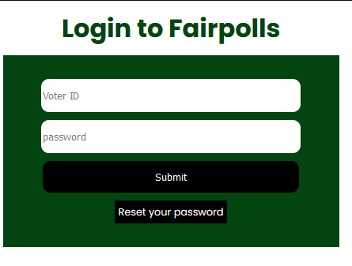

# Fairpolls Online Voting Application

This project is an online voting application created for use in a centralised system. A registered user can log in, view open polls, vote and see results as they are collated. Admins are able to create polls with their choices and close date.

## For use follow instructions below:
- Ensure you have python 3 installed on your computer
- Fork this repo
- Clone it on your computer.
- Navigate to the root "fairpolls" folder in your command prompt or shell.
- Set up a virtual environment by typing `python -m venv env`.
- Activate the Virtual environment by typing `env\
scripts\activate`.
- Prepare migrations from the models by typing `python manage.py makemigrations`.
- Create database tables by running `python manage.py migrate`.
- You may then run the server by running `python manage.py runserver`.
- You should see a url representing your localhost, Open it in a browser on your system.
- Be sure to append 'polls' to the end of the url. Example: 127.0.0.1:8000/polls

 If you followed the above steps properly you should be at the login page of the application.

If you have any inquiry or issue you can reach me on [X](x.com/ndigitals001) 

